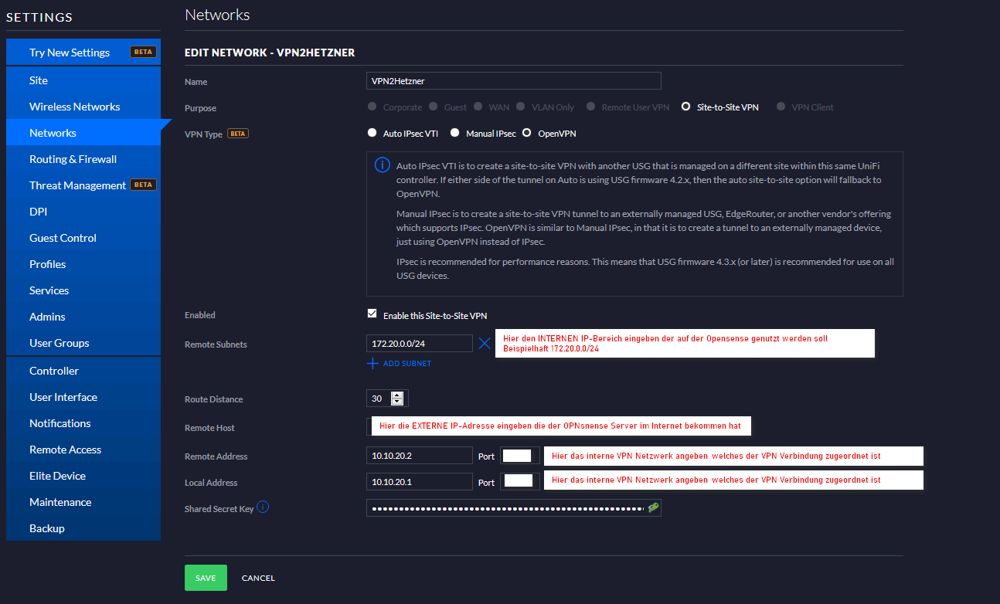

# **Create VPN connection to a Cloud server with a Unifi USG3 and double NAT (behind a router)**

```json
// And here the first Manual under preparation - updating nearly daily
```
:snowman: still under :construction: :snowman:
# **Vorwort**

Hallo Leute,

ich habe mich nach langer Zeit mal dazu entschlossen, wie es ist einen externen gemieteten Server in sein eigenes Netzwerk zu integrieren.
Bisher habe ich mich immer gesträubt, da vernünftige Server als dedicated root Server dann doch schon bei >30€ aufwärts liegen.

Allerdings habe ich mich nun für einen Cloud :cloud: Server entschieden um zumindest mal zu testen wie das ist und wie es geht. 

Die Entscheidung hat mir für mich persönlich die Firma Hetzner abgenommen, da ich mal eben einen Cloud Server für 2,89€ pro Monat mieten kann :exclamation: Well done und thank you :exclamation:

Also auf geht’s – interessant wird es allerdings erst dadurch, dass ich eine Unifi USG3 habe und diese sich des Doppel-NATs bedient und somit es noch etwas schwieriger ist ABER auf jeden Fall machbar.
Diese Konstellation werden denke ich viele möglicherweise haben, die die Box des ISP nur noch als Modem nutzen möchten (und evtl. als DECT Station) aber das Netzwerk aus welchen Gründen auch immer zB mit Unifi Geräten aufbauen möchte. In meinem Fall hier mit einer Unifi / UI / Ubiquity USG 3 als "Zentrale".
Da auch die Konfiguration des Hetzner Netzwerkes sowie der USG und des internen / externen Datenverkehrs nicht einfach mal trivial ist schreibe ich alles zusammen und somit ist dieses Manual entstanden.
Schon einmal vorher sorry für diese lange bebilderte Anleitung :joy:

# **Aufbau**
* Cloud Server mit IP-Adresse zzz.zz.z.z (hier beispielhaft 172iger Bereich)
* Unifi USG hinter Fritzbox (Exposed Host) und somit Doppel-NAT (ganz wichtig bei dieser Konfiguration, da Doppel-NAT für die USG nicht so einfach zu händeln ist) mit IP-Adresse xxx.xxx.xx.x (hier beispielhaft 192iger Bereich)
* Gesamter Datenverkehr geht nur über eine VPN Site to Site Verbindung
* Beide Netzwerke sollen untereinander erreichbar sein um zB einen iobroker auf dem Cloud-Server laufen zu lassen 
* sämtlicher Datenverkehr in der Could geht über ein zentrales Gateway und hat somit auch Zugang zum Internet. Bei mir ist es eine OPNsnese Firewall

# **1.	Vorbereitung des Cloud Servers**
Ich habe mich für die Hetzner Cloud entschieden und habe dort den einfachsten Server genommen, den es dort gibt. Dort soll einfach nur ein Firewall erstellt werden.
Dies habe ich Software-technisch mittels OPNsense gelöst – darauf bezieht sich auch meine Beschreibung. Alternativ kann man auch das Iso.Image für einen Mikrotik nehmen - kommt bei mir aber nicht zum Zuge.

Wie das Netzwerk und Subnetze und die Server anzulegen sind, [ist gut hier beschrieben.](https://blog.resch.cloud/2020/05/16/privates-netzwerk-in-der-hetzner-cloud/)

Deswegen gehe ich nicht weiter darauf ein, wie das Hetzner-Netzwerk aufzusetzen ist. 
ABER bitte nicht das Mikrotech Image einspielen sondern dafür die OPNsense.
Hat man den Rechner angemietet, so bitte die Funktion des ISO-Images nutzen. Zugangsdaten gibt es per E-Mail (Einmalpasswort).

<details>
<summary>Click to expand - Bild 01</summary>


</details>

**Empfehlung Nr. 1 - wie oben beschrieben:**

Da es sein kann, dass man sich mal bei dem Konfigurieren irgendwie mal verhaut (so wie bei mir :stuck_out_tongue_winking_eye:) ist es hilfreich einen zweiten Cloudserver aufzusetzen, so wie es auch in der Anleitung im Link steht und damit dann die OPNsense zu administrieren. Über das Konsolen-Interface bei Hetzner kommt man IMMER an diesen Rechner dran ! Ich habe ein Ubuntu / Debian System genommen mit einer Oberfläche, so dass ich ohne Probleme über die Hetzner Konsole auf die GUI zugreifen und einen Browser öffnen konnte.
Mich hat das für 4 Tage keine 50 Cent gekostet, da Hetzner Stundengenau abrechnet :+1 Länger brauchte ich den zweiten Rechner nicht - danach habe ich diesen gelöscht und meinen richtigen Cloud-Server aufgesetzt.

**Empfehlung Nr.2 – erstmal Lan-Zugang sperren und alles über VPN machen!**

Dazu erstmal auf dem OPNsense Server die LAN Netzwerkkarte abschalten! 
WAN Interface setzen.

Bitte auf die Konsole gehen:

<details>
<summary>Click to expand - Bild 02</summary>


</details><br>

Login Daten eingeben (Login plus Passwort - einmalig per Email bekommen)

Bitte dann Option 1 wählen und durch den GUIDE gehen und nur WAN setzen auf vtnet0. 

LAN bitte leer lassen. Wird später konfiguriert.

# **2.	VPN Verbindung aufbauen**

So nun hat man die OPNsense am laufen und nur das WAN ist aktiviert – bei mir ist es die Schnittstelle vtnet1.
Vtnet0 ist abgeschaltet und hat momentan KEINE Verbindung - wird später dazu geschaltet.

<details>
<summary>Click to expand - Bild 03</summary>


</details><br>

Es gibt natürlich die Möglichkeit manuell immer die OpenVPN Verbindung aufzubauen allerdings meiner Meinung nicht geeignet für 24/7 Datenaustausch.

Dies geht allerdings sehr einfach in dem man die OpenVPN Verbindung manuell in der OPNsense erstellt und sich das *.ovpn File herunterlädt und in seinem Heimnetzwerk dann mittels OpenVPN Programm importiert.

Die Site to Site Verbindung ist komplexer insb. weil die USG D-NAT hat, worum es ja auch hier in diesem Manual / Guide geht. 

Warum ? Bei dieser Konstellation hat man IMMER an der WAN-Schnittstelle die interne IP anliegen und gar niemals die externe, was natürlich für die VPN Verbindung ein Problem ist.

Was nun :question::question::question:

Da meiner Meinung nach die Dokumentation von Unifi echt verbesserungswürdig ist, habe ich alles nur durch trial and error herausbekommen – leider. Aber nun gut jetzt läuft es ja :+1:

Gut was ist nahe liegend um eine site2site Verbindung aufzumachen? Ja klar IPsec!
Nach Langem hin und her ist es bei einem D-NAT **NICHT** möglich (out of the box) eine IPsec Verbindung aufzubauen. Möglicherweise ist es möglich, aber da muss man auf der USG die json ordentlich verbiegen was für mich schlichtweg keine Option war.

Also scheidet die Möglichkeit IPsec aus!

Was gibt es noch? Nun, ich kann ja den Radius Server von der USG benutzen und mache eine L2TP Verbindung auf! Okay dann mal los.

Nach langen herumprobieren :walking: Boing ein zweites Mal in die Sackgasse gerannt! 

Warum ? 

Bei L2TP MUSS ich die Ports UDP 500 und 4500 Port forwarden WAS ABER NICHT GEHT!
Dies lässt die USG schlichtweg nicht zu.

Unter Troubleshooting auf der offiziellen UI Seite heißt es dann auch:

„…It is not possible to forward UDP port 500 and UDP port 4500 to a device and use them for the L2TP VPN on the USG/UDM at the same time. ..”

[Nachzulesen hier.](https://help.ui.com/hc/en-us/articles/360002668854)

Als ich die Regel angelegt hatte gab es auch eine Fehlermeldung und es ist einfach nicht möglich!

Gut als alle guter Dinge sind DREI :dancers:

Es bleibt nur noch OpenVPN übrig um die Site to Site Verbindung zu erstellen!
Dies beschreibe ich im nächsten Kapitel.

# **3.	Konfiguration der OpenVPN Verbindung auf der USG mittels Unifi Controller**

Geht nach

<code>**Einstellungen - Netzwerk - Neues Netzwerk**</code>

erstellen

<details>
<summary>Click to expand - Bild 04</summary>



</details><br>

Bitte bedenken, dass der Pre Shared key vom Server (Unifi Controller) später hierhin kopiert werden muss!
Und zwar ohne Leerzeichen / Zeilenumbrüche / Absätze – einfach ein sehr langer String !

[Auch noch einmal alles hier gut nachzulesen.](
https://help.ui.com/hc/en-us/articles/360002426234-UniFi-USG-VPN-How-to-Configure-Site-to-Site-VPN#6)


Wer will kann sich (später) per ssh auf die USG einloggen und sich das Live Log anschauen – damit konnte ich sehr gut Fehler analysieren ob und wie die VPN Verbindung aufgebaut wird!
[Ist auch hier beschrieben.](
https://help.ui.com/hc/en-us/articles/204959834-UniFi-How-to-View-Log-Files)

Ich habe 
<code>tail -f /var/log/messages </code>
genutzt

# **4. OpenVPN erzeugen auf der OPNsense**
Setze den OpenVPN Server auf. Gehe zu:

<code>VPN - OpenVPN - Servers - ADD</code>

<details>
<summary>Click to expand - Bild 05</summary>


</details>

<details><br>

<summary>Click to expand - Bild 06</summary>


</details><br>

Zum Testen, ob die Verbindung steht am besten unter 

<code>VPN - OpenVPN - Connection Status</code>

Oder

<code>VPN - OpenVPN - Log File</code>

Schauen, welche Meldungen kommen. Ich habe den Verbose Level dafür auf Stufe 6 gesetzt, dann sieht man am meisten:

<details>
<summary>Click to expand - Bild 07</summary>


</details><br>

Wenn die Verbindung erfolgreich war dann sieht es unter Connection Status so aus:

<details>
<summary>Click to expand - Bild 08</summary>


</details><br>

Am schwierigsten war es hier für die USG die Standard encryption herauszufinden. 

Per default verwendet die USG3 anscheinend hier die Encryption BF-CBC 128-bit sowie den ADA von SHA1 (160-bit).

Leider habe ich noch nicht herausgefunden, wie diese Verbindung hochzuschrauben ist um zB 256-Bit zu nutzen.

Auch der Support hat mir bisher keine Antwort darauf gegeben! (update wird folgen!)

Jetzt noch ein paar Firewall regeln um den Traffic zu koordinieren und dann kann es zum nächsten Punkt gehen.

# **5. Auf geht’s zur OPNsense Konfiguration**

Ich habe mich meistens auf dem zweiten Rechner per Hetzner Konsole verbunden (Installiert habe ich ein Ubuntu mit dem Standard Desktop) und von dort die OPNsense aufgerufen.

<code>https://172.20.0.2</code>

Beim erstmaligen Aufruf einfach dem Guide folgen und in Schritt 4 einfach noch die Option **NICHT** ankreuzen

<code>Block bogon networks</code>

Nun gehen wir zu

<code>Interface - Assignments</code>

und fügen das Interface **vtnet1** hinzu – sieht dann so aus:

<details>
<summary>Click to expand - Bild 09</summary>


</details><br>

Nun gehen wir nach

<code>Interface - LAN</code>

Bitte einfach auf 

IPv4 Configuration Type auf DHCP setzen und das Interface ankreuzen (Enable interface).

<details>
<summary>Click to expand - Bild 10</summary>


</details><br>

:exclamation:**ACHTUNG:**:exclamation:
Bevor die Regeln nur APLLIED werden bitte VORHER NOCH DAS HIER MACHEN:

<code>System  Routes  Configuration</code>

Neue Route – sieht dann so aus:

<details>
<summary>Click to expand - Bild 11</summary>


</details><br>
07_Bild

Nun können die Regeln von oben bestätigt werden!

(Hinweis – Hetzner liefert den DHCP selber auf der 1er Nummer, daher immer beim Netzwerk bei 2 anfangen. Ebenso managed Hetzner den DHCP nach draußen – hier eine 172.31.iger Nummer!)

Gehe nach

<code>Interfaces - Settings</code> 

und hake zusätzlich die Option „Disable hardware checksum offload“ an:

<details>
<summary>Click to expand - Bild 12</summary>


</details><br>

Nun nach 

<code>Firewall - NAT - Outbound</code> 

gehen. Die Option „Hybrid Outbound NAT rule generation” anhaken:

<details>
<summary>Click to expand - Bild 14</summary>


</details><br>

Folgendes mapping dort erstellen und abspeichern ABER NOCH NICHT Apply drücken, das sieht dann so aus:

<details>
<summary>Click to expand - Bild 15</summary>


</details><br>

Nur auf SAVE klicken.

Gehe zu 

<code>Firewall - Rules - LAN</code> 

und editiere oder lege eine neue Regel an falls nicht vorhanden (Description = Default allow LAN to any rule):

<details>
<summary>Click to expand - Bild 16</summary>


</details><br>

Nun können die Sachen APPLIED werden!

Gehe zu

<code>Firewall  Rules  WAN</code>

Und lege eine neue Regel an – sieht dann so aus:

<details>
<summary>Click to expand - Bild 17</summary>


</details><br>

Save und Apply drücken !

Nun zurückgehen auf 

<code>Firewall - NAT - Outbound</code>

und erst jetzt auf APPLY drücken!

Das wars dann doch schon :joy::joy::joy:


### Known issues

- updating nearly daily
- first version is german explanation
- english version will follow

### Changelog

### 0.0.1
* (Seqway) initial alpha version in german
