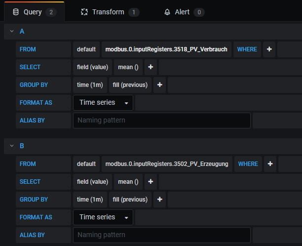
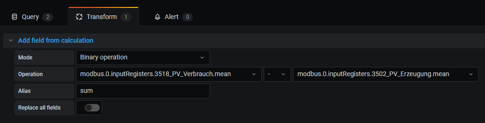
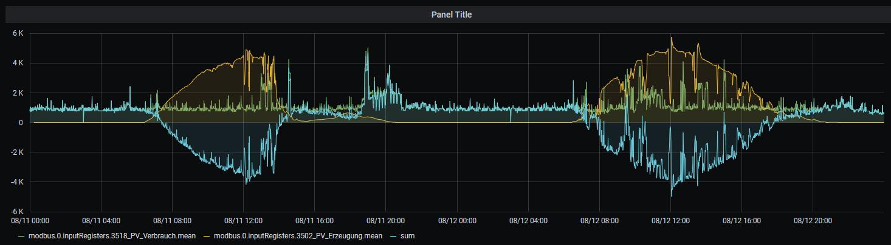
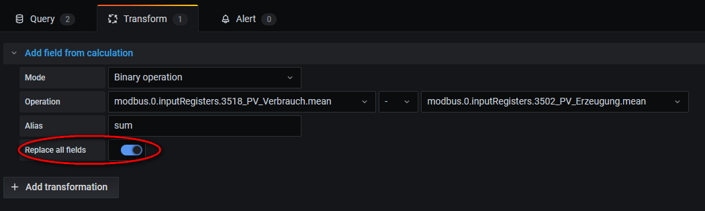
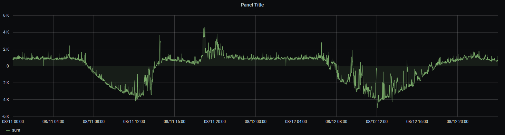

# **Grafana - more than one value and doing math operations**

:snowman: :snowman:
# **Introduction**

There is one general rules while operating with databases:

If you have the VALUE that you need available but you need to make methematical operations than try to do it directly in Grafana rather then to write a script and put a new datapoint into your database.

Therefore i make an example where you have two different values (metrics) and want to have a third one while adding or subtracting them from each other !

I make it on the example of a solar power unit!

# **Usecase - Solar Power**

1. you have an value of the produced (solar) power actually
2. You have your current load of power demand e.g. from your house
3. Substract power house consumption from your produced power from solar unit to see when i have to buy power from my power supplier

Choose your two datapoints:

Go to TRANSFORM page and do your math:

The result while naming the new curve "sum" is shown here:

You can eliminate the two values and only show the "sum" by the choice of "Replace all fields":

Please take care of grafana documentation of using 

+ GROUP BY fucntion (time)
+ fill() function
+ avoiding writing NULL

If you have questions please let me know :-) Hope you like it

## Known issues

(still) to do or to update

## Support me
If you like my work, please consider a personal donation  
(this is an personal Donate link for me - Seqway aka Dirk)  

## Changelog

### 0.0.1
* (Seqway) official release
